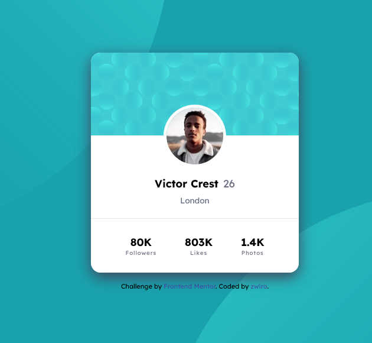

# Frontend Mentor - Profile card component solution

This is a solution to the [Profile card component challenge on Frontend Mentor](https://www.frontendmentor.io/challenges/profile-card-component-cfArpWshJ). Frontend Mentor challenges help you improve your coding skills by building realistic projects. 

## Overview

### The challenge

- Build out the project to the designs provided

### Screenshot

### Links

- Solution URL: [Solution](https://www.frontendmentor.io/solutions/profile-card-component-challenge-YD71cadE42)
- Live Site URL: [Live Site](https://zwiro.github.io/profile-card-component-challenge/)

## My process

### Built with

- CSS custom properties
- Flexbox

